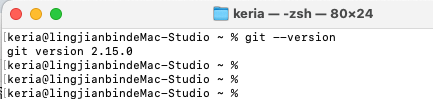
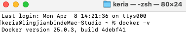
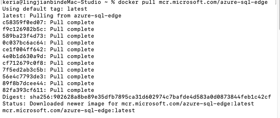
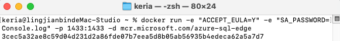
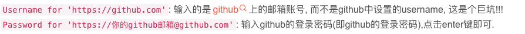

# git安装

1. **访问Git官网**： 打开浏览器，访问 [Git官方网站](https://git-scm.com/download/mac)。
2. **下载安装包**： 从网站上下载适用于macOS的 `.dmg` 安装文件。
3. **安装Git**： 打开下载的 `.dmg` 文件，并按照安装向导指示进行安装。
4. **验证安装**： 安装完成后，打开终端（Terminal），输入 `git --version`。系统能够显示出Git的版本号，表示Git已经成功安装。

# docker安装

#### 1. 访问下载页面

- 打开浏览器，访问 Docker Hub，这是Docker的官方下载页面。

#### 2. 下载Docker Desktop

- 选择适用于Apple Silicon的版本。通常网站会自动检测芯片类型并推荐合适的版本，但确认选择的是“Mac with Apple Chip”的下载链接。
- 点击“Download”按钮开始下载`.dmg`安装文件。

#### 3. 安装Docker Desktop

- 下载完成后，打开`.dmg`文件。
- 在打开的窗口中，将Docker图标拖拽到“应用程序”文件夹。

#### 4. 运行Docker Desktop

- 前往“应用程序”文件夹，找到Docker应用并双击启动。
- 首次运行时，可能会出现安全提示，需确认允许Docker运行。
- 完成这些步骤后，Docker图标会出现在菜单栏，显示为正在运行状态。

#### 5. 验证Docker安装

- 打开终端（Terminal）。
- 输入命令`docker --version`检查Docker版本，确认Docker已正确安装。
- 输入命令`docker run hello-world`来运行一个测试容器，以验证Docker引擎是否正常工作。

#### 6.下载Azure SQL Edge Docker镜像

- docker pull mcr.microsoft.com/azure-sql-edge

#### 7.启动Azure SQL Edge 数据库容器

- 自动接受用户协议，并设置系统管理员密码，同时将容器的 SQL 服务器默认端口1433映射到主机的同一端口docker run -e "ACCEPT_EULA=Y" -e "SA_PASSWORD=Console.log" -p 1433:1433 -d mcr.microsoft.com/azure-sql-edge`：

  - `docker run`：此命令创建并启动一个新的容器实例。

  - `-e "ACCEPT_EULA=Y"`：在容器内设置环境变量，自动接受最终用户许可协议。

  - `-e "SA_PASSWORD=Console.log"`：设置 SQL Server 的系统管理员（SA）密码。

  - `-p 1433:1433`：将主机上的1433端口映射到容器的1433端口，这是 SQL Server 的默认端口。

  - `-d`：以分离模式运行容器，意味着它在后台运行。

  - `mcr.microsoft.com/azure-sql-edge`：指定用于容器的镜像。

# md笔记上传到github时遇到的问题

1.图片无法显示问题

- ​	原因：md文件上传到github了但是图片没有上传到github
- ​        解决办法：新建一个.assets文件，把图片都复制进去

2.上传图片时git push origin main遭到了拒绝

- ​	原因：username并非github的用户名，而是邮箱。password并非登录密码而是一个可生成的个人token
- ​        解决办法：
  - 查看自己github的关联邮箱方法：右上角个人图标 -> settings -> email（在右边一栏）。
  - 创建token方法：右上角个人图标 -> settings -> developer settings（在右边一栏）-> create new tokens会提示完成一些对于生成token的设置，比如有效期，可以用来干嘛的权限，设置一下就好。

